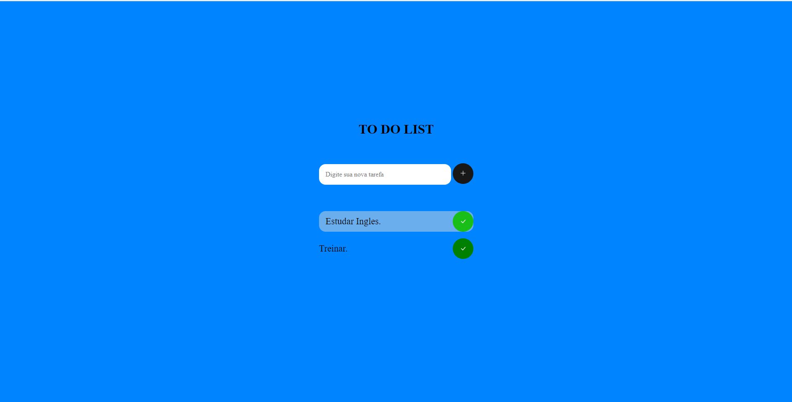

# ToDOList

## 📜 Índice
- <a href="#-descrição">Descrição</a>
- <a href="#-layout">Layout</a>
- <a href="#-tecnologias-utilizadas">Tecnologias utilizadas</a>

# 💭 Descrição
Este projeto é um aplicativo da Web simples que permite aos usuários criar e gerenciar uma lista de tarefas. Os usuários podem adicionar novas tarefas, marcar tarefas como concluídas e remover tarefas da lista. A interface é limpa e fácil de usar, facilitando a organização e o acompanhamento das tarefas.
- Você pode acessar o projeto por meio deste link: <a>https://todolist329.netlify.app//<a>

## 📲 Layout

 
 

## 🔧 Tecnologias utilizadas
 
1. HTML 
2. CSS 
3. JAVASCRIPT

